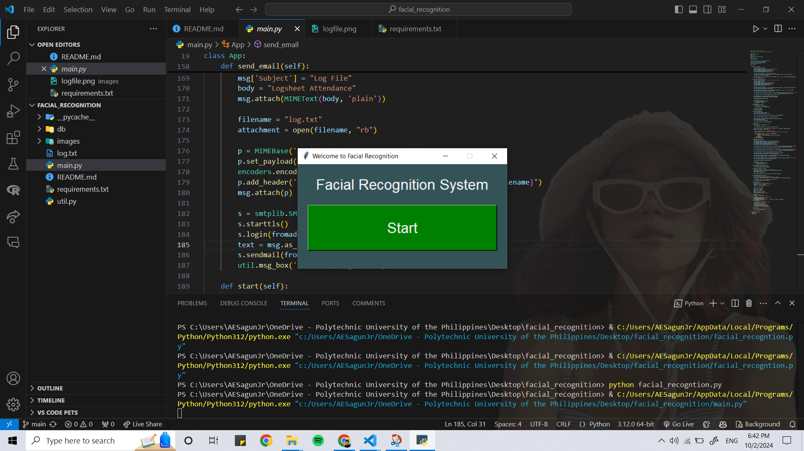
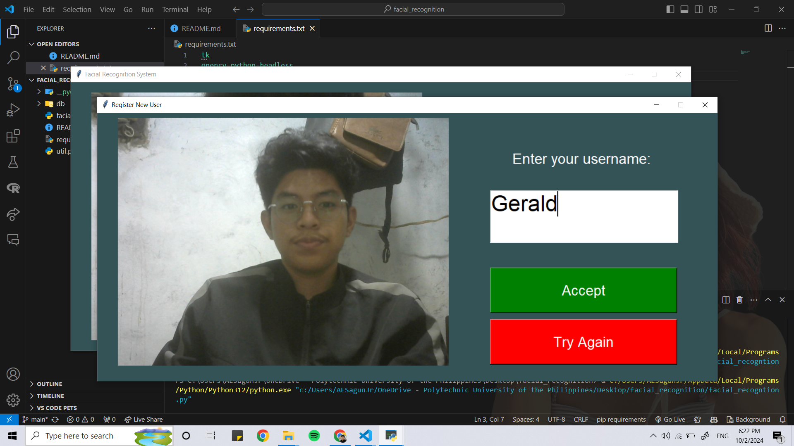
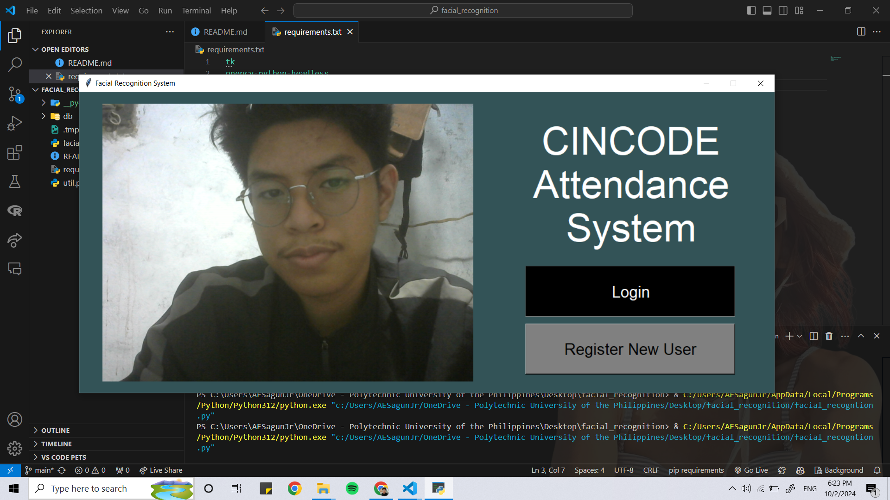
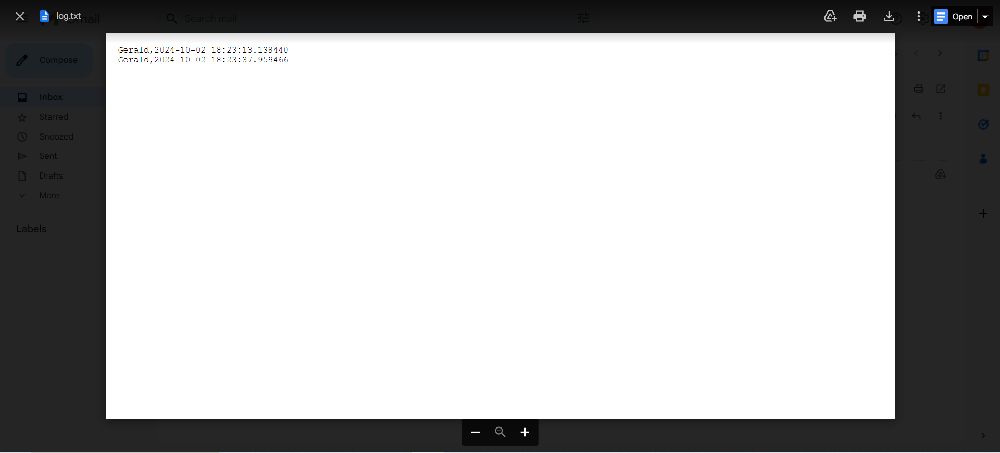
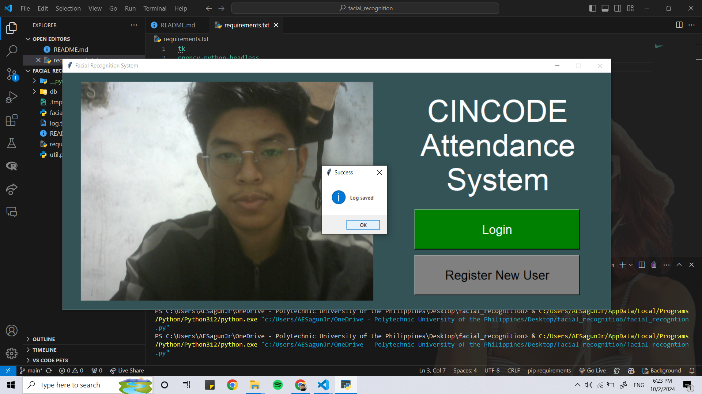

# **Face Recognition with Attendance and Email System**



## Features
- Face recognition for attendance tracking
- Automatic email of log file to Gmail

## YouTube Link
[Watch the tutorial](https://www.youtube.com/watch?v=z_dbnYHAQYg&t=461s)

## Installation

### Prerequisites
- Python 3.x
- pip (Python package installer)

### Steps
1. Clone the repository:
    ```sh
    git clone <repository-url>
    ```
2. Navigate to the project directory:
    ```sh
    cd <project-directory>
    ```
3. Install the required packages:
    ```sh
    pip install -r requirements.txt
    ```
4. Run the program:
    ```sh
    python main.py
    ```

## Walkthrough

### Registering
1. Open the application.
2. Click on the "Register" button.
3. Follow the on-screen instructions to register your face.


### Logging In
1. Open the application.
2. Click on the "Login" button.
3. The system will recognize your face and log you in.


### Sending the log.txt File
1. Ensure you are logged in.
2. The system will automatically send the `log.txt` file to your Gmail account at the end of the day.



## Additional Information
This project includes a feature not covered in the YouTube video: it automatically sends the log file to your Gmail account.